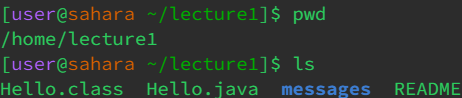

# Week 1 Lab Report
## `cd`
__No Arguments__
* 
* 
* I ran the command in both `/home/lecture1` and `/home/lecture1/messages` directories.
* With both directories, when you run `cd` with no argument, you're returned to the `/home` directory (you stay in the `/home` directory if you're already there). 
* The output is not an error.
 

__Directory As Argument__
* 
* I ran the commands in the `/home` directory.
* I tried to change to the `/home/lecture1/messages` directory and was able to successfully do so (as seen with `pwd` or the prefix).
* The output is not an error.
 

__File As Argument__
* 
* I ran the command in the `/home` directory.
* While I tried to change to the `/home/lecture1/messages/en-us.txt` file, since it isn't a directory it gave me an error and I was unable to do so.
* The output is an error since you can't change to a non-directory with `cd`.
 

## `ls`
__No Arguments__
* 
* 
* I ran the commands in the `/home` and `/home/lecture1` directories.
* With both directories, without an argument, ls lists the files and directories in the respective current working directories.
* The output is not an error.
 

__Directory As Argument__
* 
* I ran the command in the `/home` directory.
* I listed what's in the `/home/lecture1/messages` directory, `Hello.class`, `Hello.java`, the `messages` folder/directory, and `README`.
* The output is not an error.
 

__File As Argument__
* 
* I ran the commands in the `/home` and `/home/lecture1/messages` directories.
* With both directories, it just returned the path that I inputted for the file (`/lecture1/messages/en-us.txt` and `en-us.txt`).
* The output is not an error.
 

## `cat`
__No Arguments__
* 
* I ran the commands in the `/home` and `/home/lecture1` directories.
* In both directories, it just returns whatever you type into the terminal, but you can get out of it with `Ctrl + C` or `Ctrl + D` (recommended).
* The output is not an error.
 

__Directory As Argument__
* 
* I ran the command in the `/home` directory.
* I tried to `cat` the `/home/lecture1` directory and it returned an error since `lecture1` is a directory instead of a file.
 

__File As Argument__
* 
* I ran the commands in the `/home` directory.
* I concatenated the `README` and `Hello.java` files in the `/home/lecture1` directory and it returned the text contents of the files.
* The output is not an error.

***

## Notes
* If you try to access a file/directory with the incorrect path for the directory you're in, i.e. `ls messages` while in `/home` instead of `/home/lecture1`, or there's a misspelling, you will get an error saying there's no such file/directory.
