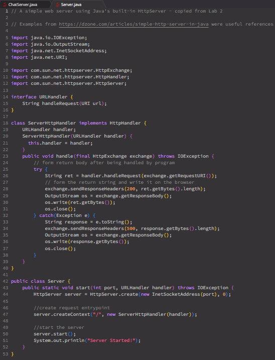

# Week 3 Lab Report
## Part 1
**Code** 

  
**Using `/add-message`** 

* The `handleRequest` method is called from the `ChatServer`'s `main` method, which creates a new server with the usage of the `start` method in the `Server` and the `handle` method in `ServerHttpHander`.
* The `main` method takes in the input from the console to create a `Server` with the specified `int port` (`4000` in this case). It then created a server with the `URI url` `0-0-0-0-4000-bejpr7a1q2b6adnmtjsb25ei28.us.edusercontent.com`. After adding `/add-message/s=Hello&user=jpolitz`, the `handleRequest` method takes the entire `url` and splits the query (everything after the question mark) based on = into the `parameters` array. The `parameters` array is then checked to include `"s"` and two more `String`s for the `user` and `message`. The `user` and `message` then gets added to the `messages` `String` to become `"jpoilitz: Hello\n"`.
* The only value that really changes is the `messages` `String` since it goes from being empty to containing `"jpolitz: Hello\n"`. Then because of the change of the `url`, the `parameters` array, and `String` `message` and `user` variables get updated.
  

* The `handleRequest` method is called from the `ChatServer` class in the already opened server.
* The `URI url` `0-0-0-0-4000-bejpr7a1q2b6adnmtjsb25ei28.us.edusercontent.com/add-message/s=How are you&user=yash` is the most important argument, with the `handleRequest` method taking the entire `url` and splitting the query (everything after the question mark) based on = into the `parameters` array (`{"s", "How+are+you&user", "yash"}`).
* The only value that really changes is the `messages` `String` since it goes from being empty to containing `"jpolitz: Hello\nyash: How are you\n"`. Then because of the change of the `url`, the `parameters` array, and `String` `message` and `user` variables get updated. The `message` variable takes the second element of `parameters` but replaces the + with spaces so that the original query can be saved.
 
## Part 2
**SSH Keys** 
Private Key 

 Public Key 

 
## Part 3
I learned how to remotely connect to my CSE 15L account with `ssh` and create a remote server that we can use to access URLs. I also learned how to run servers on my computer with `git bash` and how to save the access key for my remote account.
