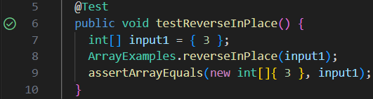
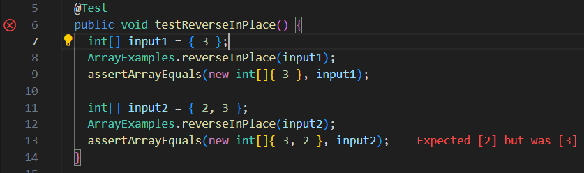

# Week 5 Lab Report
## Part 1 - Bugs
**Failure-Inducing Input**<br>
```
@Test
public void testReverseInPlace() {
  ... note 4 lines omitted ...
  int[] input2 = { 2, 3 };
  ArrayExamples.reverseInPlace(input2);
  assertArrayEquals(new int[]{ 3, 2 }, input2);
}
```
**Success-Inducing Input**<br>
```
@Test 
public void testReverseInPlace() {
  int[] input1 = { 3 };
  ArrayExamples.reverseInPlace(input1);
  assertArrayEquals(new int[]{ 3 }, input1);
}
```
**Output**<br>
*Success*

*Failure*

**Code**<br>
*Before*
```
static void reverseInPlace(int[] arr) {
  for(int i = 0; i < arr.length; i += 1) {
    arr[i] = arr[arr.length - i - 1];
  }
}
```
*After*
```
static void reverseInPlace(int[] arr) {
  for(int i = 0; i < arr.length / 2; i += 1) {
    int hold = arr[i];
    arr[i] = arr[arr.length - i - 1];
    arr[arr.length - i - 1] = hold;
  }
}
```
**Description:** This fixes the issue since originally the code would just iterate through the provided array arr and basically put the last element at each index (so the array test I provided would give {3, 3} 
instead of {3, 2}). So instead I made it so that it saved the element before changing it and only ran for half of the original time (i < arr.length / 2) so that it would switch the first and last elements for each
iteration.<br><br>
## Part 2 - Researching Commands (find)
**
