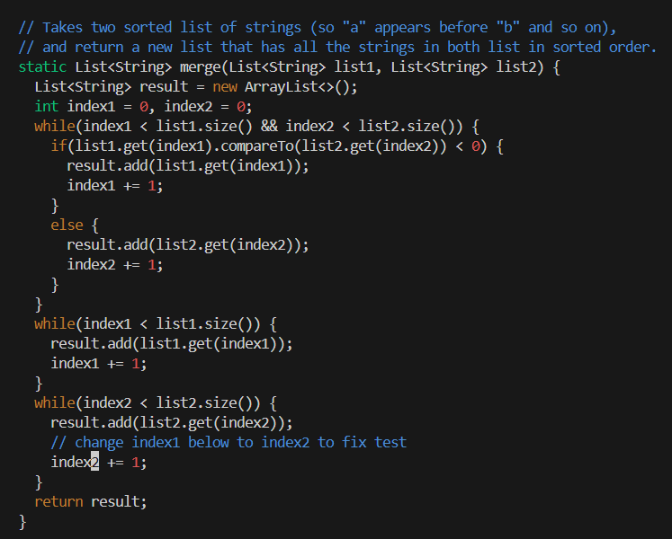

# Week 7 Lab Report
## Step 4 - Log In

* Key Presses: `ssh <space> hgregersen@ieng6-202.ucsd.edu <enter>`
* Summary: I used `ssh` to sign into the remote server `ieng6-202` with my username `hgregersen`.
 
## Step 5 - Clone with `SSH` URL

* Key Presses: `git <space> clone <space> <Ctrl+V> <enter>`
* Summary: I used `git clone` to clone the forked repository with the `SSH` URL I generated and copied with `Ctrl+C` to paste with `Ctrl+V`.
 
## Step 6 - Test Run Failure

* Key Presses: `cd <space> la <tab> <enter> bash <space> test.sh <enter>`
* Summary: I first changed to the `lab7` directory with `cd` and used `tab` to autocomplete `la` to `lab7`. I ran the `test.sh` bash script that was in the `lab7` repository to compile and run the `ListExamplesTests` file.
 
## Step 7 - Fix Failing Test

* Key Presses: `vim <space> L <tab> . <tab> <enter> /change <enter> j l l x i 2 <esc> :x <enter>`
* Summary: I first ran `vim ListExamples.java` to check and change the code since the test timed out, showing that the `ListExamples.java` `merge` method most likely had an infinite loop. I then used `/change` find and get to the first occurence of `change` (line 43). I then used `j` and `l` to move to the `1` in the variable name `index1` in the next line. I then used `x` to delete that `1` and changed it to a `2` with `i` to go into insert mode. I then quit out of that mode with `<esc>` and used `:x` to save and quit vim.
 
## Step 8 - Test Run Success

* Key Presses: `<up> <up> <enter>`
* Summary: The `bash` command I ran was 2 up in the search history, so I used the `<up>` arrow to access it and recompile and rerun the tests.
 
## Step 9 - Commit and Push Changes

* Key Presses: `git <space> add <space> -A <enter> git <space> commit <space> -m <space> "ListExamples.java" <enter> git <space> push <space> origin <space> main <enter>`
* Summary: I used `git add -A` to stage all changes made and then used `git commit -m "Fixing ListExamples.java"` to save the changes to the local repository with a specific message. I then used `git push origin main` to push the changes to the actual GitHub repository.
* Note: The second image is to show that the GitHub repository was in fact changed recently.
