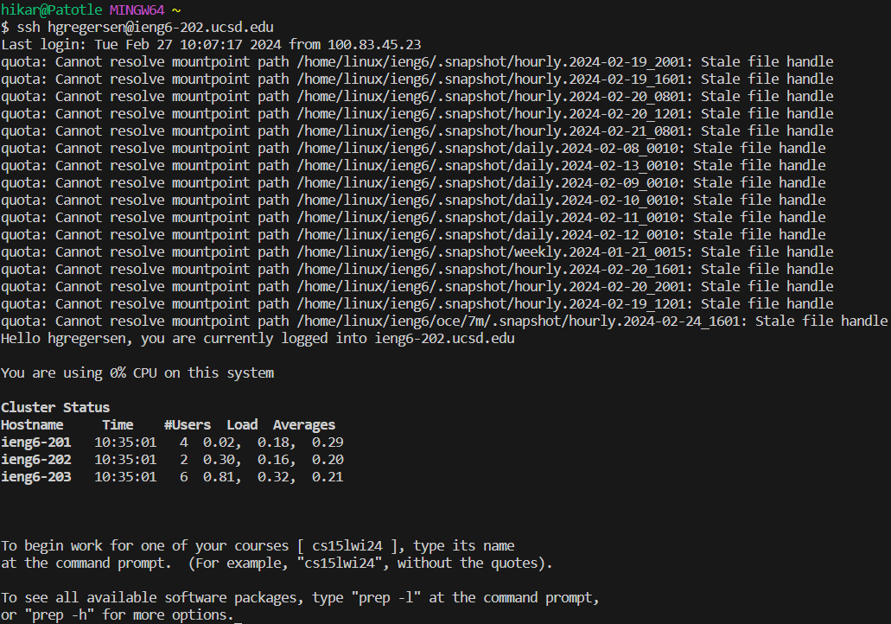
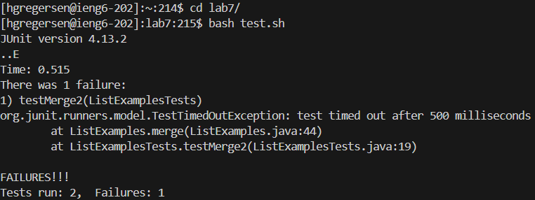
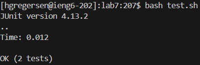

# Week 7 Lab Report
## Step 4 - Log In

* Key Presses:
* Summary: I used `ssh` to sign into the remote server `ieng6-202` with my username `hgregersen`. 
## Step 5 - Clone with `SSH` URL

* Key Presses:
* Summary: I used `git clone` to clone the forked repository with the `SSH` URL I generated and copied with `Ctrl+C` to paste with `Ctrl+V`. 
## Step 6 - Test Run Failure

* Key Presses:
* Summary: I used the modified `javac` and `java` commands to compile and run the `ListExamplesTests` file. 
## Step 7 - Fix Failing Test

* Key Presses: `<shift>+g, k, k, <shift>+<left>, <shift>+<left>, <shift>+<left>, i, <backspace>, 1, h, h, h, h, <backspace>, 2, <esc>, :, x, <enter>`
* Summary: I used `<shift>+g` to get to the very bottom of the file and then used `k` and `<shift>+<left>` to get to `l2`. I then used `i` to switch to insert mode and change line 19's `(l1, l2)` to `(l2, l1)`. I then quit out of that mode with <esc> and used `:x` to save and quit vim. 
## Step 8 - Test Run Success

* Key Presses: `<up>, <up>, <up>, <enter>, <up>, <up>, <up>, <enter>`
* Summary: The modified `javac` command was 3 up in the search history, so I used the up arrow to access it and the modified `java` command was then 3 up in the history, so I accessed and ran it in the same way. 
## Step 9 - Commit and Push Changes

* Key Presses: 
* Summary: I used `git commit -A` to stage all changes made and then used `git commit -m "Fixing ListExamples.java"` (messed up the file name in the commit message) to save the changes to the local repository. I then used `git push origin main` to push the changes to the actual Github account.
* Note: The second image is to show that the github repository was in fact changed recently.
