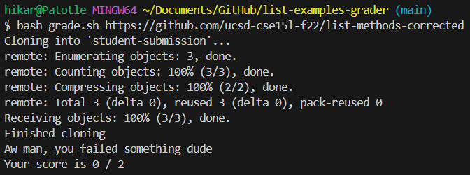
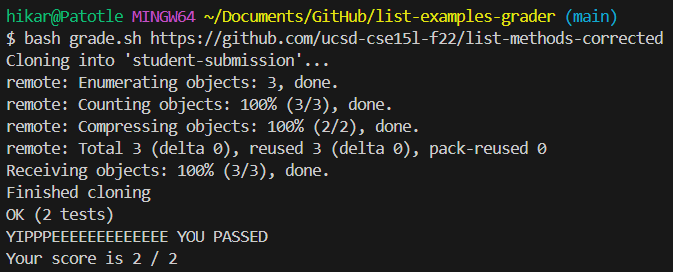
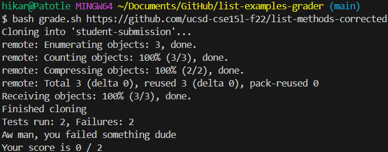

# Week 9 Lab Report
## Part 1 - Debugging Scenario
**Student Post**<br>
<br>
  Hi! I wanted to know if I could get any help with my code. I assume it is not my conditional in my `/c/Users/hikar/Documents/GitHub/list-examples-grader/grade.sh` `bash` script since it (based on the output) correctly returns that the tests failed and gave its respective output. Since it claims that the tests failed, I assume that it's something to do with my code in `/c/Users/hikar/Documents/GitHub/list-examples-grader/TestListExamples.java`.<br><br>
**TA Response**<br>
  Can you make sure that you are using the correct assert methods for your tester methods and that you are comparing the correct expected and actual outputs? You should also maybe add a line in your `bash` script to check if the output returns that it actually fails or if it is running the conditional incorrectly.<br><br>
**Student Response**<br>
  Before:
  ```
  import static org.junit.Assert.*;
  import org.junit.*;
  import java.util.Arrays;
  import java.util.List;
  
  class IsMoon implements StringChecker {
    public boolean checkString(String s) {
      return s.equalsIgnoreCase("moon");
    }
  }
  
  public class TestListExamples {
    @Test(timeout = 500)
    public void testMergeRightEnd() {
      List<String> left = Arrays.asList("a", "b", "c");
      List<String> right = Arrays.asList("a", "d");
      List<String> merged = ListExamples.merge(left, right);
      List<String> expected = Arrays.asList("a", "a", "b", "c", "d");
      assertSame(expected, merged);
    }
  
    @Test
    public void testFilter() {
      List<String> tester = Arrays.asList("moon", "stars", "moon");
      List<String> expected = Arrays.asList("moon", "moon");
      IsMoon sc = new IsMoon();
      List<String> actual = ListExamples.filter(tester, sc);
      assertSame(expected, actual);
    }
  }
  ```
  After:
  ```
  import static org.junit.Assert.*;
  import org.junit.*;
  import java.util.Arrays;
  import java.util.List;
  
  class IsMoon implements StringChecker {
    public boolean checkString(String s) {
      return s.equalsIgnoreCase("moon");
    }
  }
  
  public class TestListExamples {
    @Test(timeout = 500)
    public void testMergeRightEnd() {
      List<String> left = Arrays.asList("a", "b", "c");
      List<String> right = Arrays.asList("a", "d");
      List<String> merged = ListExamples.merge(left, right);
      List<String> expected = Arrays.asList("a", "a", "b", "c", "d");
      assertEquals(expected, merged);
    }
  
    @Test
    public void testFilter() {
      List<String> tester = Arrays.asList("moon", "stars", "moon");
      List<String> expected = Arrays.asList("moon", "moon");
      IsMoon sc = new IsMoon();
      List<String> actual = ListExamples.filter(tester, sc);
      assertEquals(expected, actual);
    }
  }
  ```
<br>
  I realized that I was using the wrong assert methods as `assertSame` checks the `Object` references instead of the actual content, and since two different `ArrayLists` were being created and compared, they had two different references, making the statement return false for both tests. So, I changed it from `assertSame` to `assertEquals` so that the actual content was compared and the `grade.sh` ran correctly (picture above).<br>
<br>
Lines 37-40 of `/c/Users/hikar/Documents/GitHub/list-examples-grader/grade.sh`
  ```
  java -cp $CPATH org.junit.runner.JUnitCore TestListExamples > junit-output.txt
  
  lastline=$(cat junit-output.txt | tail -n 2 | head -n 1)
  echo $lastline
  ```
  I also added code to my `bash` script to show the output of compiling and running the testers and it revealed that the tests were failing (picture above).

## Part 2 - Reflection
  I found the conditionals you could implement in `bash` scripts to be pretty interesting as their formatting is different than the conditionals I've used and implemented before. Additionally, I thought the fact that you can use the output of what you ran as a variable or input for a new function/variable with `bash` and just have premade commands for the terminal was pretty cool. Lastly, I thought that the ability to use `vim` to read and edit your code from the terminal was fascinating since I didn't know it was possible and it could make editing code while `ssh`ing easier.
